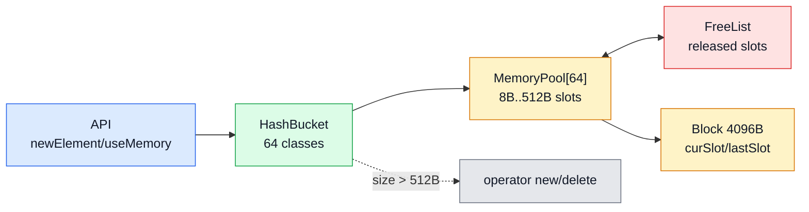
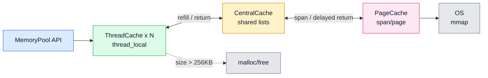
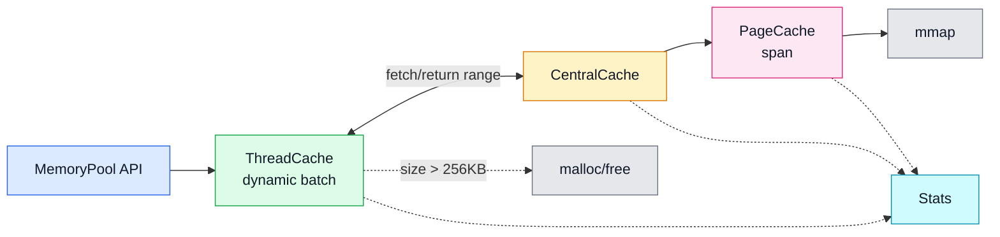

# cpp-memory-pool

一个面向高频小对象分配场景的 C++ 内存池,按 v1/v2/v3 三个版本迭代:v1 是基础 free list,v2 引入 `ThreadCache / CentralCache / PageCache` 三层缓存,v3 加入 dynamic batch、stats counters 和 cold/warm benchmark。

项目的目标是把一个内存池做完整并量化:结构如何拆分、线程本地缓存如何接入、何时回源、benchmark 如何设计,以及哪些场景下会回退到系统 allocator。不预设"内存池一定比 `malloc/free` 快"——只讨论 workload 匹配时的收益与代价。

## 范围

只做小对象内存池本身,不做通用 allocator 的全套生态。释放接口需要传回 size,大对象直接绕过;这让实现能把注意力放在 size class、free list、线程本地缓存、中心缓存竞争和 page/span 管理上。

几个前提:

- v1 建立了 size class + free list 的基本模型,但在 fixed immediate 和 mixed size 下不占优——这正是引入 v2 线程本地缓存的动机。
- v2 的主要变化是把高频路径放进 `thread_local ThreadCache`。小对象 fixed/mixed 场景明显更适合这个结构。
- v3 加了按对象大小变化的 batch 策略和 counters,但不是所有场景都比 v2 更快。较大 size class、多线程同 class 和 return threshold 都需要看数据。
- 大对象绕过本质上还是 `malloc/free`,不应该拿来证明内存池优势。
- 现代 `malloc/free` 已经有线程缓存和 fast path。这个项目只讨论 workload 匹配时的收益和代价。

不做的范围:

- 不接管全局 `new/delete`。
- 不接 STL allocator。
- 不处理 NUMA、跨平台虚拟内存策略、后台回收、安全隔离。
- 不保证所有场景快于系统 allocator。
- 不把长生命周期对象、变长对象、大对象作为主要优化对象。

## 目录与版本

```text
.
├── v1/                  # 基础 MemoryPool / HashBucket / Slot / free list
├── v2/                  # ThreadCache / CentralCache / PageCache 三层缓存
├── v3/                  # dynamic batch、stats counters、cold/warm benchmark
└──  docs/                # 性能分析、benchmark 说明、调试记录
```

benchmark 的原始 txt 输出在本地生成,未包含在本仓库;可按下文「构建与运行」重新运行各 `v*_benchmark` 复现。下面的 benchmark 数字来自 `docs/v1_benchmark_notes.md`、`docs/v2_benchmark_notes.md`、`docs/v3_benchmark_notes.md` 里记录的 Release 平均表。

## 版本架构

### v1: 基础 free list 内存池



v1 用 `HashBucket` 把小对象映射到 64 个固定 slot size 的 `MemoryPool`。每个池的 block 大小是 4096B,内部按 slot 切分;释放后的 slot 挂回 free list,后续同 size class 优先复用。超过 `MAX_SLOT_SIZE = 512B` 的对象直接走 `operator new/delete`。

### v2: 三层缓存结构



v2 把高频小对象路径放到线程本地：每个线程有自己的 `ThreadCache`,本地命中时不访问全局锁。`CentralCache` 负责跨线程共享空闲块,`PageCache` 负责向系统申请 page/span。超过 `MAX_BYTES = 256KB` 的对象绕过三层缓存。

### v3: dynamic batch + stats



v3 保留三层缓存，但把 refill 数量和对象大小绑定：小对象一次多拿，较大对象一次少拿。额外加入可选 counters 和 cold/warm benchmark，用来解释本地命中、中心缓存交互和 `mmap` 路径。

## 工程问题

1. size class 和对齐。v2/v3 把请求大小按 8B 向上取整,再映射到 `FREE_LIST_SIZE` 个 free list。好处是每个 class 都能用简单链表管理;代价是有内部碎片。v1 的上限是 `512B`,v2/v3 的上限是 `256KB`。

2. free list 节点复用。释放后的块不额外分配元数据,直接把块开头当作 `next` 指针。这个实现简单,也解释了为什么 `deallocate(ptr, size)` 必须知道 size:释放时要回到正确的 size class。

3. 线程本地缓存。v2/v3 用 `thread_local ThreadCache` 保存每个线程自己的 free list。本地命中时只做 pop/push,不碰全局锁。miss 才进入 `CentralCache`,本地缓存超过阈值再归还一部分。

4. 中心缓存竞争。`CentralCache` 是进程级共享结构,按 size class 分锁,用 `atomic_flag` 自旋保护链表。同一个 size class 被多个线程集中访问时,锁竞争仍然会出现;这也是 multi same class 场景优势不稳定的主要原因。

5. page/span 管理。`PageCache` 用 `mmap` 向系统申请页,再按 size class 切给上层。v2 里还尝试延迟把完整空闲 span 归还给 `PageCache`;v3 当前更关注 batch 和统计,span 管理保持简单实现,没做合并优化。

6. dynamic batch。v3 里 `getBatchNum(size)` 按对象大小决定一次拿多少块:小对象多拿,大对象少拿。这样能减少小对象频繁 miss,也避免大对象在线程本地囤太多内存。它不是无条件提速,4096B 这类场景会更频繁访问中心缓存。

7. stats 和 cold/warm 隔离。v3 加了 `ENABLE_MEMORY_POOL_STATS`,记录 ThreadCache hit/miss、CentralCache fetch/return、PageCache span/systemAlloc。后面又把 stats benchmark 拆成 cold/warm,避免前面的测试把 `thread_local` 缓存预热后误导结论。

## 压测:方法与结果

方法:Release 构建,每组 benchmark 先 warm up,再多轮取平均。核心循环不打印;分配出的内存会写入少量字节,并把指针低位累加进 sink,防止编译器把分配路径优化掉。多线程场景先在线程本地累加,结束后再写全局 atomic,避免把统计变量竞争混进分配循环。

测试入口:

- v1:`MemoryPoolProject` 做基础正确性测试,`v1_benchmark` 做 A/B。
- v2/v3:`unit_test` 做正确性测试,`perf_test` 保留早期性能演示,`v*_benchmark` 做系统对比。
- 对比项:memory pool、`malloc/free`、`operator new/delete`。

已记录的 Release 平均结果(单位 ms;`malloc/pool > 1.0` 表示池快于 `malloc/free`):

| version | scenario | size | iters | threads | pool | malloc | new | malloc/pool | 读法 |
|---|---|---:|---:|---:|---:|---:|---:|---:|---|
| v1 | fixed immediate | 64 | 500000 | 1 | 8.732 | 2.971 | 4.765 | 0.340 | 立即分配/释放下慢 |
| v1 | batch alloc/free | 64 | 200000 | 1 | 4.558 | 9.342 | 9.191 | 2.054 | 批量生命周期有优势 |
| v1 | repeated reuse | 64 | 1000000 | 1 | 18.854 | 12.051 | 16.082 | 0.640 | 复用收益被 CAS 重试吃掉 |
| v1 | mixed small sizes | mixed | 300000 | 1 | 5.237 | 2.352 | 5.706 | 0.449 | mixed size 慢于 malloc |
| v2 | fixed immediate | 64 | 200000 | 1 | 0.656 | 1.190 | 2.022 | 1.817 | ThreadCache 热路径有效 |
| v2 | batch alloc/free | 64 | 80000 | 1 | 0.342 | 0.996 | 1.088 | 2.911 | 小对象批量表现好 |
| v2 | multi same class | 64 | 50000 | 8 | 1.287 | 1.395 | 1.603 | 1.082 | 同 class 高并发只小幅领先 |
| v2 | mixed small sizes | mixed | 200000 | 1 | 0.969 | 2.646 | 3.392 | 2.731 | mixed 小对象快 |
| v3 | fixed immediate | 64 | 200000 | 1 | 0.659 | 1.202 | 2.035 | 1.827 | 与 v2 接近 |
| v3 | batch alloc/free | 64 | 80000 | 1 | 0.590 | 0.960 | 1.082 | 1.627 | 仍快,但不如 v2 记录值 |
| v3 | multi same class | 64 | 50000 | 8 | 1.337 | 1.332 | 1.695 | 0.996 | 8 线程基本打平 |
| v3 | mixed small sizes | mixed | 200000 | 1 | 1.151 | 2.765 | 3.511 | 2.566 | mixed 仍有优势 |
| v3 | long stress mixed | mixed | 500000 | 1 | 2.251 | 6.658 | 8.723 | 2.956 | 长 mixed 压测更适合 |
| v3 | large bypass | 524288 | 20000 | 1 | 0.615 | 0.631 | 0.633 | 1.026 | 大对象绕过,差异很小 |

结论:

- v1 用来建立模型,不适合拿来做"小对象一定更快"的结论。
- v2 的收益主要来自 `thread_local ThreadCache`,尤其 fixed/mixed 小对象。
- v3 把 batch 策略固定下来,但性能不是单调变好。batch 越保守,大对象占用越少,但中心缓存访问会变多。
- large bypass 接近 `malloc/free`,这是预期结果。

stats 诊断里,64B repeated reuse 的 ThreadCache hit rate 约 97.1%,但仍有数万次 CentralCache fetch/return;4096B refill pressure 的 hit rate 约 26.5%。这说明瓶颈不一定在 `mmap`,很多时候在 return/refill 策略和中心缓存竞争。

更完整的数据和分析在:

- `docs/v1_benchmark_notes.md`
- `docs/v2_benchmark_notes.md`
- `docs/v3_benchmark_notes.md`
- `docs/v1_performance_analysis.md`
- `docs/v2_performance_analysis.md`
- `docs/v3_performance_analysis.md`

## 构建与运行

依赖:Linux/WSL、CMake、g++。v2/v3 用了 `<sys/mman.h>`,普通 Windows MSVC 不在当前支持范围内。

### v1

```bash
cmake -S v1 -B v1/build -DCMAKE_BUILD_TYPE=Release
cmake --build v1/build
./v1/build/MemoryPoolProject
./v1/build/v1_benchmark
```

### v2

```bash
cmake -S v2 -B v2/build -DCMAKE_BUILD_TYPE=Release
cmake --build v2/build
./v2/build/unit_test
./v2/build/perf_test
./v2/build/v2_benchmark
```

也可以使用 CMake 自定义目标：

```bash
cmake --build v2/build --target test
cmake --build v2/build --target perf
```

### v3

```bash
cmake -S v3 -B v3/build -DCMAKE_BUILD_TYPE=Release
cmake --build v3/build
./v3/build/unit_test
./v3/build/perf_test
./v3/build/v3_benchmark
```

v3 相关 CMake 选项:

```bash
# 为全部 v3 target 打开 stats
cmake -S v3 -B v3/build -DCMAKE_BUILD_TYPE=Release -DMEMORY_POOL_ENABLE_STATS=ON

# 默认行为：只为 v3_benchmark 打开 stats
cmake -S v3 -B v3/build -DCMAKE_BUILD_TYPE=Release -DMEMORY_POOL_ENABLE_BENCHMARK_STATS=ON
```

## 已知限制与优化方向

当前边界:

- v1 的 CAS free list 没有系统处理 ABA。早期高并发同 size class 实验暴露过稳定性风险。
- `CentralCache` 虽然按 size class 分锁,但同 class 高并发仍会争同一把自旋锁。
- v3 的 return threshold 仍是固定 64。做过 size-aware threshold 实验:64B batch/reuse 变快,但 mixed small sizes 和 long stress mixed 回退,所以没有当成确定优化合入。
- `PageCache` 用 `std::map` 和全局 mutex,span 查找/合并/回收都比较朴素。
- `deallocate(ptr, size)` 依赖调用者传正确 size。传错 size 会挂到错误 class,这个项目没有做安全兜底。
- 当前只看平均耗时,还没有 P50/P95/P99、RSS 峰值、碎片率、锁等待次数。
- benchmark 数字受机器、glibc allocator、CPU 状态、编译选项影响。README 里的表只代表 docs 中记录的那组 WSL/Linux Release 结果。

后续优化:

- 给 CentralCache 统计自旋次数和等待时间,把同 class 竞争单独量化。
- 统计 ThreadCache 本地 free list 水位和 RSS 峰值,判断 batch 策略有没有用内存换吞吐。
- 增加 P50/P95/P99 延迟,避免只看平均值。
- 改 PageCache 的 span 索引和合并策略,减少 `std::map` 和全局 mutex 的影响。
- 继续调 return threshold,但必须同时看 mixed workload、中心缓存交互次数和内存占用。

## 来源

最初参考 [youngyangyang04/memory-pool](https://github.com/youngyangyang04/memory-pool.git)。本仓库在此基础上做了 v1/v2/v3 梳理、ThreadCache 计数修复、CentralCache return 语义修正、benchmark 重构、stats counters 和 cold/warm 测试记录。
