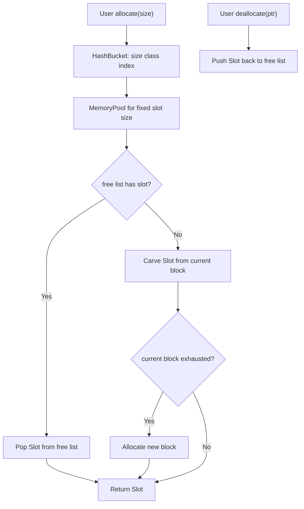
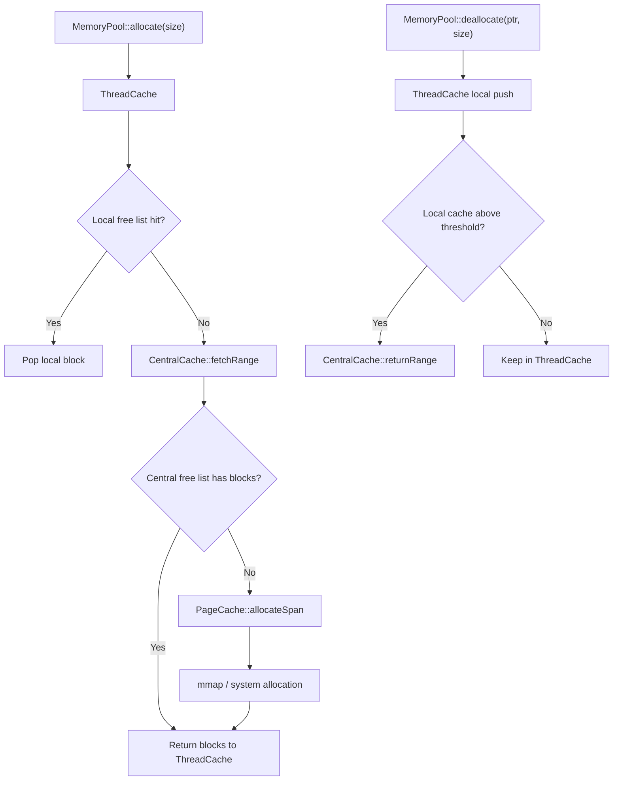
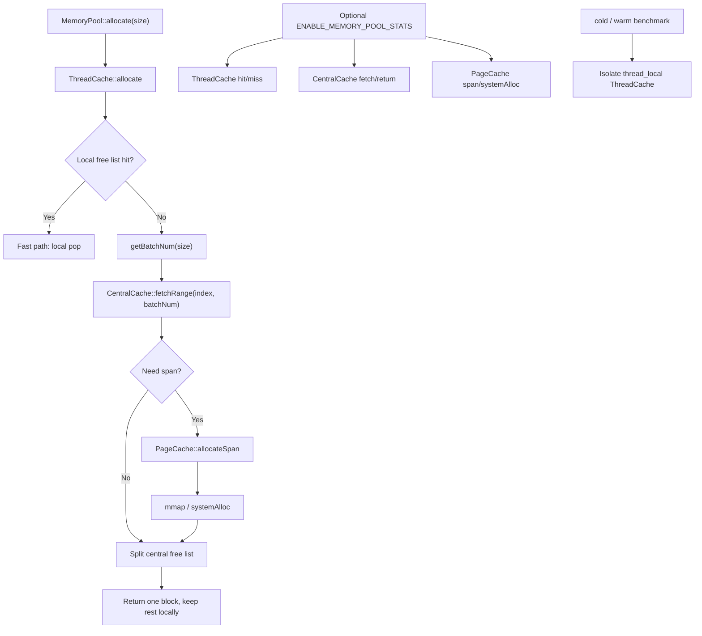

# C++ High Performance Memory Pool

一个面向高频小对象分配场景的 C++ 内存池项目。项目从基础 free list 内存池逐步演进到类似 TCMalloc 思路的 `ThreadCache / CentralCache / PageCache` 三层缓存结构，并补充了系统化 benchmark、正确性修复、可选统计 counters 和 cold/warm benchmark 隔离。

这个项目的重点不是简单证明“内存池一定比 `malloc/free` 快”，而是展示一个完整的性能工程闭环：

```text
复现公开项目 -> 本地构建与调试 -> 重构 benchmark -> 发现问题
-> 修复正确性 -> 增加 counters -> cold/warm 隔离 -> 基于数据决策优化
```

## 1. 项目简介

本项目实现并分析了多个版本的 C++ 内存池，用于理解：

- size class 如何降低小对象管理复杂度。
- free list 如何复用已释放内存块。
- ThreadCache 如何减少多线程下的中心锁访问。
- CentralCache 如何协调跨线程空闲块。
- PageCache 如何以 page/span 粒度向系统申请大块内存。
- benchmark 为什么必须区分 Debug/Release、cold/warm、fixed/mixed、small/large object。

需要明确的是：内存池不是所有场景都比现代 `malloc/free` 快。现代 allocator 本身已经有 thread cache、size class、arena 和 fast path。内存池只有在 workload 匹配时，例如高频小对象、固定 size class、复用充分、锁竞争可控，才更容易体现优势。

## 2. 项目来源与二次优化说明

本项目基于公开项目 [youngyangyang04/memory-pool](https://github.com/youngyangyang04/memory-pool.git) 进行学习、复现和二次整理，不包装成完全原创项目。

我在参考实现基础上完成了：

- Windows / WSL / Linux 环境下的本地 CMake 构建和测试验证。
- v1 / v2 / v3 三个版本的 benchmark 重构。
- Debug 和 Release 测试流程整理。
- 命名空间统一重构为 `Avery_memoryPool`。
- ThreadCache 计数问题和 CentralCache 归还语义问题的正确性修复。
- v3 optional allocator stats counters。
- v3 cold/warm benchmark 隔离。
- 面试讲述文档和性能分析文档整理。

## 3. 为什么做内存池

在服务端和 AI Infra 场景中，经常存在大量短生命周期对象：

- request context
- scheduler node
- token metadata
- temporary communication buffer
- KV cache block handle

如果这些对象频繁直接走系统 allocator，可能带来：

- 分配释放路径开销。
- 锁竞争。
- 内存碎片。
- 延迟抖动。
- 难以解释的 tail latency。

内存池的思路是把常见小对象按 size class 复用，把高频路径留在线程本地，把系统分配和跨线程协调放到更低频的批量路径中。

## 4. 三个版本架构

### v1: 基础 MemoryPool / HashBucket / Slot / free list

v1 是基础小对象内存池：

- `HashBucket` 按对象大小映射到不同 bucket。
- 每个 bucket 对应一个 fixed-size `MemoryPool`。
- `Slot` 在释放后作为 free list 节点复用。
- 超过小对象范围的分配直接走系统分配。

v1 适合理解内存池基本原理，但它不一定比 `malloc/free` 快。比如 immediate allocate/free 中，HashBucket 映射、atomic/CAS、block 扩容和对象构造析构都可能带来额外开销。

### v2: ThreadCache / CentralCache / PageCache

v2 从基础内存池升级为三层缓存：

- `ThreadCache`: 每个线程优先访问本地 free list，本地命中时不需要全局锁。
- `CentralCache`: 跨线程共享空闲块，负责 ThreadCache refill 和 return。
- `PageCache`: 以 page/span 为单位向系统申请内存，再切分给 CentralCache。

v2 的核心价值是减少多线程高频小对象分配中的中心锁竞争。

### v3: 动态 batch 策略、正确性修复、stats counters、cold/warm benchmark

v3 在 v2 基础上强化 batch 策略：

- 小对象一次从 CentralCache 获取更多块，减少中心缓存访问。
- 较大对象一次获取更少块，避免线程本地囤积过多内存。
- 修复 `freeListSize_` 计数语义问题。
- 修复 `CentralCache::returnRange` 参数语义，使其明确接收 block count。
- 增加 optional stats counters，观察 ThreadCache / CentralCache / PageCache 行为。
- 增加 cold/warm benchmark 隔离，减少前序测试预热对结论的污染。

## 5. 架构图

### v1



### v2



### v3



## 6. Benchmark 设计

项目补充了更完整的 benchmark，而不是只运行小 demo：

- fixed size: 固定大小对象立即分配释放，观察 fast path。
- batch alloc/free: 先批量分配保存到 vector，再统一释放，模拟 request context 生命周期。
- repeated reuse: 多轮复用同一个 size class，观察 free list 稳定性。
- multi-thread same size: 多线程同一 size class，观察锁竞争。
- mixed size: 混合 8B 到 4096B 小对象，模拟真实服务中不同临时对象大小。
- refill pressure: 观察 ThreadCache miss 后进入 CentralCache/PageCache 的成本。
- large object bypass: 验证大对象不应作为小对象内存池优势场景。
- cold/warm isolation: 区分首次 miss/refill 和预热后的 ThreadCache local fast path。

benchmark 使用 `std::chrono::steady_clock`，核心循环中不打印，保存分配指针并写入少量字节，避免编译器优化掉分配结果。Release 结果用于性能结论，Debug 主要用于正确性验证。

## 7. 我发现并处理的问题

### 内存池不一定比 malloc/free 快

v1 在部分 batch alloc/free 场景有优势，但 fixed immediate、mixed size、large bypass 等场景并不稳定。v2/v3 在很多小对象场景表现更好，但多线程 same size、较大对象 refill、large bypass 仍然需要谨慎解释。

结论是：内存池不是万能加速器，必须结合 workload 分布和 benchmark 设计分析。

### v2/v3 `freeListSize_` 计数问题

调试中发现 `freeListSize_` 可能在空链表 miss 时错误递减，导致 `size_t` 下溢；从 CentralCache refill 后，也要避免把返回给用户的 block 计入线程本地缓存。

修复后，`freeListSize_` 只表示 ThreadCache 本地 free list 中真实保留的空闲块数量。

### v3 `CentralCache::returnRange` 参数语义问题

`returnRange` 的参数需要明确表示 block count，而不是模糊的 size/bytes。否则调用侧传入字节数、内部按块数遍历，会导致链表切分和归还语义不清。

修复后，调用侧传入实际归还块数，CentralCache 内部也按 block count 遍历。

### return threshold 实验有混合结果，因此未盲目合入

我实验过 size-aware return threshold：小对象保留更多本地块，较大对象更早归还。结果显示部分 64B batch/reuse 场景变快，但 mixed / long stress 场景明显回退。

因此我没有把它包装成确定优化，而是记录为实验，并继续用 counters 和 cold/warm benchmark 分析原因。

### stats experiment 被预热污染，因此补充 cold/warm 隔离

原 stats experiment 排在完整 benchmark 后面，前序测试已经填热多个 size class，导致 mixed / long stress 直接显示 100% local hit。

后续补充 cold/warm 模式：

- cold mode: 每轮使用新 worker thread，近似隔离 `thread_local ThreadCache`。
- warm mode: 同一线程先 warm up，再 reset counters，观察纯热路径。
- 输出 avg/min/max/stddev，减少单次结果误导。

## 8. 与 AI Infra 的关系

这个项目虽然是 C++ CPU 内存池，但它对应的是 AI Infra 中非常常见的资源复用模式：

- request context: 请求生命周期内频繁创建和释放的小对象。
- scheduler node: 推理调度中短生命周期节点。
- token metadata: token 级别的小块元数据。
- communication buffer: 临时通信和序列化 buffer。
- KV cache block 管理: 按 block 复用大块资源。
- buffer pool: worker-local 优先复用，中心池协调跨 worker 资源。

类比关系：

- `ThreadCache` 类似 worker-local buffer pool。
- `CentralCache` 类似跨 worker 共享 block pool。
- `PageCache` 类似底层大块内存或 GPU memory block manager。

这类设计在 PyTorch CUDA caching allocator、vLLM KV Cache block manager、推理服务 request buffer pool 中都有相似思想：按大小或规格分档、批量申请、本地复用、集中回收。

## Docs

更详细的分析记录见：

- `docs/v1_performance_analysis.md`
- `docs/v1_benchmark_notes.md`
- `docs/v2_performance_analysis.md`
- `docs/v2_benchmark_notes.md`
- `docs/v3_performance_analysis.md`
- `docs/v3_benchmark_notes.md`
- `docs/interview_notes.md`
- `docs/project_summary_for_interview.md`
